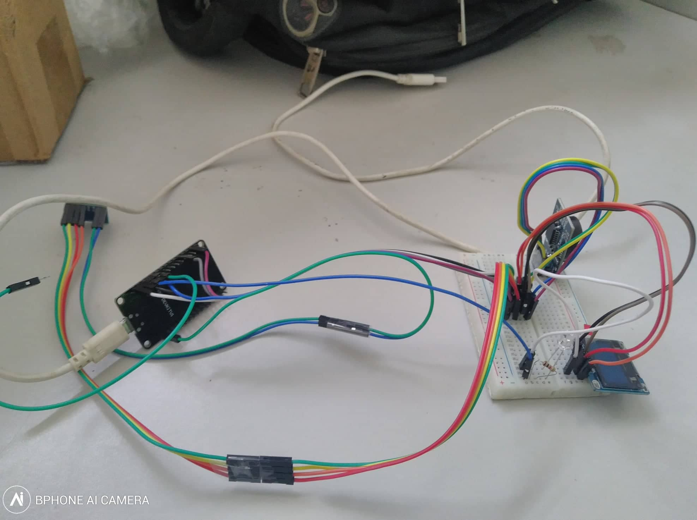

# Docs OLP BKM3T

## Sơ đồ lắp mạch 

"""TODO"""

## Hướng dẫn cài đặt Arduino IDE
- Dowload Arduino IDE tại địa chỉ
https://www.arduino.cc/en/Main/OldSoftwareReleases#previous, version 1.8.6

-  Mở chương trình Arduino chọn file-> Preferences. nhập https://dl.espressif.com/dl/package_esp32_index.json  vào Additional Board Manager URLs, rồi nhần "OK" Như hình  

- Vào boards manager, Tools > Board > Boards Manager…

- Tìm "ESP32" và nhần cài đặt "ESP32 by Espressif Systems"

- Để chạy file firmware, mở Arduino IDE, vào Tools -> Board và chọn board "DOIT ESP32 DEVKIT V1"

- Chọn cổng COM rồi nhấn nút Upload hoặc phím tắt Ctrl + U

- Đợi đến khi xuất hiện thông báo "Done Uploading" tức là đã nạp code thành công

## Cách chạy chương trình
- Lắp mạch như sơ đồ trên
- Mở file "oled_realtime_mpu6050_esp32_OLP.ino" và thực hiện nạp code cho mạch như hướng dẫn trên. Code này sẽ thực hiện đọc dữ liệu từ cảm biến gia tốc (6 giá trị Ax, Ay, Az, yaw, pitch, roll), dữ liệu thời gian, dữ liệu nhịp tim và hiển thị dữ liệu thời gian và nhịp tim lên màn hình; dữ liệu đọc được được gửi qua giao thức MQTT với topic là "m3t/mpu6050" với broker : "broker.hivemq.com". Đồng thời, mạch có tính năng cảm biến, khi chạm vào chân cảm biến, màn hình OLED sẽ thay đổi nội dung hiển thị sang "Thuc hien hanh dong". Song song với quá trình đọc dữ liệu từ cảm biến, mạch luôn đợi message tại topic "m3t/led" dùng giao thức MQTT, khi có message về thông tin hành động tới, mạch sẽ đọc message, gửi tín hiệu hồng ngoại để điều khiển các led tương ứng với các hành động nhận được.(demo 3 led) 

- Để thực hiện nhận tín hiệu hồng ngoại, sẽ có thêm 3 mạch esp32 luôn chờ nhận tín hiệu hồng ngoại để điều khiển 3 đèn led (3 đèn led mô phỏng 3 thiết bị thực tế như quạt, đèn, điều hòa, ...). Mỗi cử chỉ sẽ có một mã điều khiển riêng. Nạp code "irrecv.ino" để thực hiện nhận hồng ngoại, điều khiển thiết bị

## Mapping mã hành động vs mã HEX
- up: 0xa10
- down: 0xa20
- left: 0xa30
- right: 0xa40
- walking: 0xa50
- running: 0xa60
- standing: 0xa70
- sitting: 0xa80

## Các thư viện liên quan

- Gửi nhận dữ liệu hồng ngoại: (ESP32-IRremote) https://github.com/SensorsIot/Definitive-Guide-to-IR/tree/master/ESP32-IRremote

- Nhận thời gian từ server với NTP Client và RTC: https://github.com/arduino-libraries/NTPClient, 
https://github.com/Makuna/Rtc

- Hiển thị dữ liệu lên OLED: https://github.com/ThingPulse/esp8266-oled-ssd1306

- Cảm biến nhịp tim : https://github.com/oxullo/Arduino-MAX30100

- Cảm biến gia tốc: https://github.com/jrowberg/i2cdevlib/tree/master/Arduino/MPU6050

## Note
- Broker: broker.hivemq.com
- Topic đồng hồ gửi dữ liệu: m3t/mpu6050
- Topic đồng hồ nhận lệnh : m3t/led